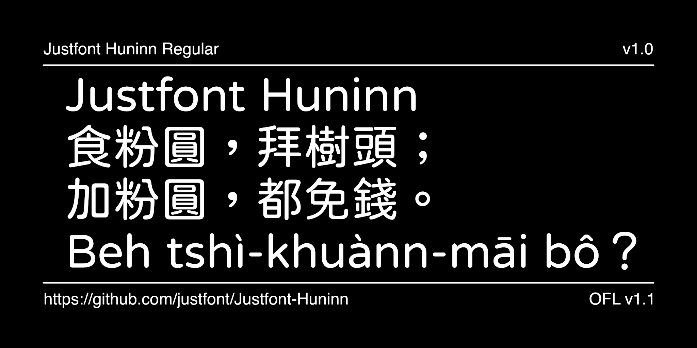

# Justfont Huninn

[![][Fontbakery]](https://justfont.github.io/Justfont-Huninn.git.git.git/fontbakery/fontbakery-report.html)
[![][Universal]](https://justfont.github.io/Justfont-Huninn.git.git.git/fontbakery/fontbakery-report.html)
[![][GF Profile]](https://justfont.github.io/Justfont-Huninn.git.git.git/fontbakery/fontbakery-report.html)
[![][Shaping]](https://justfont.github.io/Justfont-Huninn.git.git.git/fontbakery/fontbakery-report.html)

[Fontbakery]: https://img.shields.io/endpoint?url=https%3A%2F%2Fraw.githubusercontent.com%2Fjustfont%2FJustfont-Huninn.git.git.git%2Fgh-pages%2Fbadges%2Foverall.json
[GF Profile]: https://img.shields.io/endpoint?url=https%3A%2F%2Fraw.githubusercontent.com%2Fjustfont%2FJustfont-Huninn.git.git.git%2Fgh-pages%2Fbadges%2FGoogleFonts.json
[Outline Correctness]: https://img.shields.io/endpoint?url=https%3A%2F%2Fraw.githubusercontent.com%2Fjustfont%2FJustfont-Huninn.git.git.git%2Fgh-pages%2Fbadges%2FOutlineCorrectnessChecks.json
[Shaping]: https://img.shields.io/endpoint?url=https%3A%2F%2Fraw.githubusercontent.com%2Fjustfont%2FJustfont-Huninn.git.git.git%2Fgh-pages%2Fbadges%2FShapingChecks.json
[Universal]: https://img.shields.io/endpoint?url=https%3A%2F%2Fraw.githubusercontent.com%2Fjustfont%2FJustfont-Huninn.git.git.git%2Fgh-pages%2Fbadges%2FUniversal.json

Justfont Huninn is an open-source Traditional Chinese round typeface based on the [Kosugi Maru](https://github.com/googlefonts/kosugi-maru) and [Varela Round](https://fonts.google.com/specimen/Varela+Round) fonts, specially designed for better use in Taiwan.

The font includes commonly used characters in Taiwan, Zhuyin (Bopomofo) symbols, and even adds Taigi and Hokkien phonetic symbols and characters to meet local requirements. 

Besides creating more than 2,000 new characters, the designers also refined the typographic settings and improved the grayscale quality of the original sources.

Learn more about the Justfont Huninn typeface philosophy from <a href="https://justfont.com/huninn/">https://justfont.com/huninn/</a> .

## Building

Fonts are built automatically by GitHub Actions - take a look in the "Actions" tab for the latest build.

If you want to build fonts manually on your own computer:

* `make build` will produce font files.
* `make test` will run [FontBakery](https://github.com/googlefonts/fontbakery)'s quality assurance tests.
* `make proof` will generate HTML proof files.

The proof files and QA tests are also available automatically via GitHub Actions - look at `https://justfont.github.io/Justfont-Huninn.git.git`.

## Changelog

- **May 17, 2024. Version 1.00**
  - Fork from original typeface repository ([justfont/open-huninn-font](https://github.com/justfont/open-huninn-font)), modify the OFL License, and rename it to **Justfont Huninn**.

## License

This Font Software is licensed under the SIL Open Font License, Version 1.1.
This license is available with a FAQ at [https://scripts.sil.org/OFL](https://scripts.sil.org/OFL)

## About justfont

Established in 2010, justfont is a Taiwan-based new-generation type design and typography education business. Renowned works including the world's first crowdfunded Chinese font [*Jin Xuan*](https://justfont.com/jinxuan/). justfont also supports various independent type designers in Taiwan, with prominent cases such as [*Cream Font*](https://justfont.com/creamfont/), [*Burn Font*](https://justfont.com/burnfont/), *Tears Font*, and [*Taiwan Road Font*](https://justfont.com/twroadfont/).

View our website here: https://justfont.com

